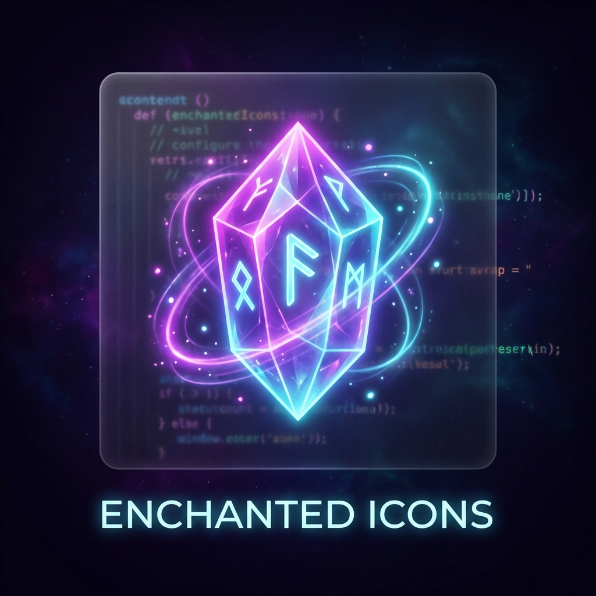

# Enchanted Icons



✨ **Magical, vibrant icon theme for VS Code and other IDEs with 1,600+ language support**

Enchanted Icons is a comprehensive icon theme featuring 6,584 carefully crafted icons across 4 beautiful, mystical color variants. Perfect for developers who want their IDE to feel magical!

## 🌍 Multi-IDE Support

Enchanted Icons is available for multiple platforms!

### [Visual Studio Code](https://marketplace.visualstudio.com/items?itemName=AshrafMorningstar.enchanted-icons)

- **Installation:** Search for "Enchanted Icons" in Extensions Marketplace
- **Manual:** Install `.vsix` from releases

### [JetBrains IDEs](ide-packages/jetbrains)

Support for IntelliJ IDEA, PyCharm, WebStorm, PhpStorm, RubyMine, CLion, etc.

- **Location:** `ide-packages/jetbrains/enchanted-icons-jetbrains`
- **Installation:** Install via "Install Plugin from Disk"

### [Sublime Text](ide-packages/sublime)

- **Location:** `ide-packages/sublime/Enchanted Icons`
- **Installation:** Copy to Packages directory

### [Neovim](ide-packages/neovim)

- **Location:** `ide-packages/neovim/enchanted-icons.nvim`
- **Installation:** Use lazy.nvim or packer.nvim

## 📷 Previews

### ✨ Mystic (Dark)

Deep, vibrant colors with magical glow - perfect for dark themes

### 🌅 Aurora (Light)

Soft pastels with ethereal tones - gentle on the eyes

### 🌙 Twilight (Soft)

Muted, dreamy colors for a calm coding experience

### 🔥 Ember (Warm)

Warm, cozy tones with golden accents

## 🔧 Installation

### From VS Code Marketplace

1. Open VS Code
2. Go to Extensions (Ctrl+Shift+X / Cmd+Shift+X)
3. Search for "Enchanted Icons"
4. Click Install
5. Press Ctrl+Shift+P / Cmd+Shift+P
6. Type "File Icon Theme" and select your preferred variant

### Manual Installation

1. Download the `.vsix` file from the [Releases page](https://github.com/AshrafMorningstar/EnchantedIcons/releases)
2. Open VS Code
3. Press Ctrl+Shift+P / Cmd+Shift+P
4. Run `Extensions: Install from VSIX...`
5. Select the downloaded `.vsix` file

## 🎨 Customization

### Settings

You can customize the icon theme with the following settings in your `settings.json`:

```json
{
  // Hide folding arrows next to folder icons
  "enchanted-icons.hidesExplorerArrows": false,

  // Configure when to use outlined folder icons
  // Options: "when-expanded", "always", "never"
  "enchanted-icons.outlinedFolders": "when-expanded"
}
```

### Custom Icon Associations

Enchanted Icons supports custom icon associations:

```json
{
  // Assign icons based on language ID
  "enchanted-icons.associations.languages": {
    "typescriptreact": "react-typescript"
  },

  // Assign icons based on file extension
  "enchanted-icons.associations.extensions": {
    "spec.ts": "test-blue"
  },

  // Assign icons to specific file names
  "enchanted-icons.associations.files": {
    "vite.config.ts": "vite"
  },

  // Assign icons to specific folder names
  "enchanted-icons.associations.folders": {
    "typings": "folder_types"
  }
}
```

## 🌟 Features

- **1,646+ Languages:** From popular to esoteric programming languages
- **6,584 Icons:** 4 magical variants × 1,646 languages
- **4 Color Variants:** Mystic, Aurora, Twilight, and Ember themes
- **Comprehensive Coverage:** Languages, frameworks, tools, and config files
- **Customizable:** Settings for explorer arrows, folder outlines, and custom associations
- **Beautiful Design:** Consistent, recognizable icons with magical aesthetics

## 📦 Icon Coverage

### Languages

Assembly, Astro, C, C++, C#, CSS, Dart, Go, Gleam, HTML, Java, JavaScript, TypeScript, Julia, Kotlin, Lua, Luau, Nim, Odin, Perl, PHP, Python, Ruby, Rust, Scala, Shell, Swift, Zig, and 1,600+ more

### Frameworks & Libraries

React, Vue, Angular, Svelte, Next.js, Nuxt, NestJS, Tailwind CSS, PostCSS

### Tools & Config

Docker, Git, ESLint, Prettier, Vite, Webpack, npm, Yarn, pnpm, Bun

### Special Files

README, LICENSE, CHANGELOG, .gitignore, package.json, tsconfig.json, and many more

## 🙌 Requests

Have an icon request or found a bug? Please [open an issue](https://github.com/AshrafMorningstar/EnchantedIcons/issues) on GitHub!

## ❤️ Inspiration

Enchanted Icons draws inspiration from:

- [Charmed Icons](https://marketplace.visualstudio.com/items?itemName=littensy.charmed-icons): Soothing pastel icons for VSCode
- [Wonder Icons](https://marketplace.visualstudio.com/items?itemName=densy-little-studio.wonder-icons): Vibrant and magical icon theme
- [Catppuccin Icons](https://marketplace.visualstudio.com/items?itemName=Catppuccin.catppuccin-vsc-icons): Beautiful pastel theme

## 📄 License

Enchanted Icons is released under the [MIT License](LICENSE).

---

**Code with magic!** ✨
